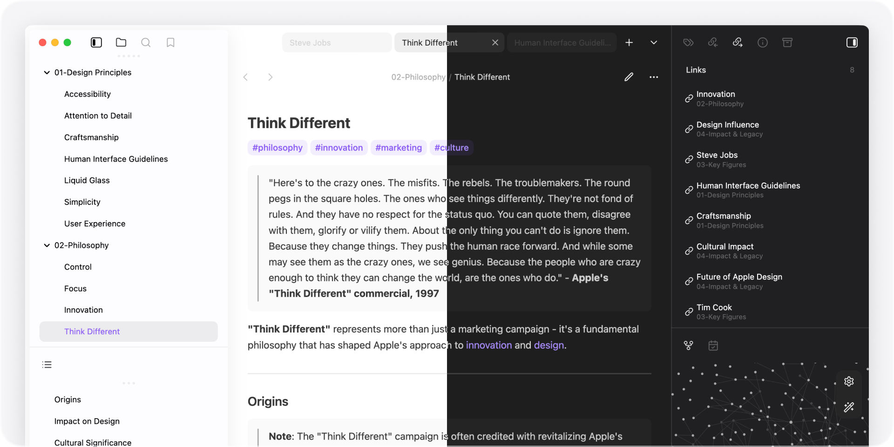
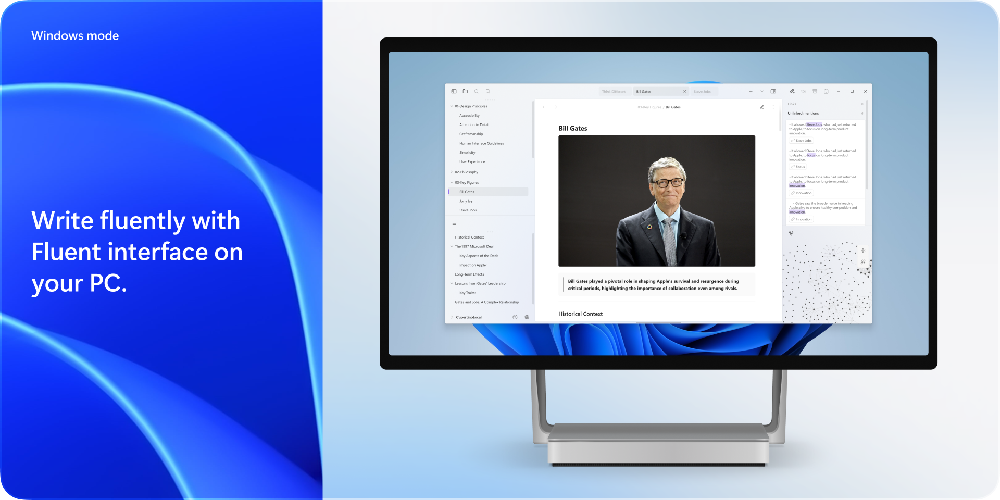

### Best Theme of Obsidian [Gems of the Year 2024](https://obsidian.md/blog/2024-goty-winners/) awards

Cupertino is an Obsidian theme, optimized for **desktop and mobile devices**. Bringing **clean, focused, comfortable** reading and writing experience to your vault.

[Support me and my work](https://www.buymeacoffee.com/sevenaxis) so I can keep regular updates and fixes. You’re also welcomed to submit pull requests.

## Overview

- **Native & minimal** — Clean, native look and feel on all of your devices, so you can focus on your content.

  

- **Optimized for mobile** — Redesigned modals, menu, editor, search, and more, with comfortable spacing for usability.

  

- **Windows Mode** — Fluent Design interface for native feeling on Windows (Enabled by default, can be disabled with [Style Settings](https://github.com/mgmeyers/obsidian-style-settings))

  

## Plugins

All features are enable by default, following plugins can be installed to modify your installation. they are **_not_** required.

### [Style Settings](https://github.com/mgmeyers/obsidian-style-settings)

- Disable active line indicator
- Disable alternative heading style
- Disable auto hiding panel actions
- Disable centered tabs
- Disable compact status bar
- Disable Windows mode
  ... etc.

### [Pseudo Mica](https://github.com/aaaaalexis/obsidian-cupertino-helper/) (Windows only)

Adds pseudo-Mica (wallpaper as background) on Windows (Alternatively, wait for Obsidian native support)

## Philosophy

I’ve spent way too much time on customizing Obsidian, thousands of themes with millions of customizations, I believe a lot people do it too. It’s anti-productivity at this point, we need something that just works and is pleasant to use.

1. **Less plugins.** — Style Settings is only used for disabling features and fixing issues instead of adding. Cupertino works perfectly out of the box.
2. **Less customizations** — Customization is often more of a distraction that makes you waste more time on fiddling. Cupertino will never add customization.
3. **Less visual noise** — Your content is the key. Low priority UI elements are auto hidden to maintain focusability on content.

## Features

Cupertino supports most filter and helper classes from [Minimal](https://github.com/kepano/obsidian-minimal).

### Banner

| Class                   | Description                                                                                 |
| :---------------------- | :------------------------------------------------------------------------------------------ |
| `banner`                | Add at the end of the image link, e.g. `![[image.jpeg\|banner]]`                            |
| `banner-fade`           | Add faded edge to the banner (requires `banner`)                                            |
| `banner-icon`           | Add an emoji or letter as note icon using callout, e.g. `> [!banner-icon] 👋`               |
| `banner-title`          | Moves inline title next to the icon (requires `banner-icon`)                                |
| `y0`, `y5`... to `y100` | Adjust the vertical position of the banner (requires `banner`), from 0 to 100 in steps of 5 |

### [Block width](https://minimal.guide/features/block-width)

| Class                                  | Description                           |
| :------------------------------------- | :------------------------------------ |
| `wide`                                 | Entire note uses wide line width      |
| `max`                                  | Entire note uses max line width       |
| `table-100`, `bases-100`, `img-100`    | Fill 100% of the pane width           |
| `table-max`, `bases-max`, `img-max`    | Fill the max line width (default 90%) |
| `table-wide`, `bases-wide`, `img-wide` | Fill the wide line width              |

### [Cards](https://minimal.guide/Block+types/Cards)

| Class                 | Description                                      |
| :-------------------- | :----------------------------------------------- |
| `cards` (required)    | Set all Dataview tables to card layout           |
| `list-cards`          | Set all bullet lists to card layout              |
| `cards-align-bottom`  | Align the last element of a card to the bottom   |
| `cards-cover`         | Images are resized to fill the defined space     |
| `cards-16-9`          | Fit images in cards to 16:9 ratio                |
| `cards-1-1`           | Fit images in cards to 1:1 ratio (square)        |
| `cards-2-1`           | Fit images in cards to 2:1 ratio                 |
| `cards-2-3`           | Fit images in cards to 2:3 ratio                 |
| `cards-cols-1` to `8` | Force a specific number of columns (from 1 to 8) |

### Embeds

| Class              | Description              |
| :----------------- | :----------------------- |
| `embed-strict`     | Remove embed background  |
| `embed-hide-title` | Hide embedded file title |

### [Image filters](https://minimal.guide/images#Image+filters)

Add at the end of the image link, e.g. `![[image.jpeg#invert]]`

| Filter       | Description                                                                        |
| :----------- | :--------------------------------------------------------------------------------- |
| `#blend`     | Blend image into background                                                        |
| `#invert`    | Invert images in dark mode — ideal for charts and handwriting on light backgrounds |
| `#invertW`   | Invert images in light mode — ideal for charts and handwriting on dark backgrounds |
| `#circle`    | Crop image to a circle                                                             |
| `#outline`   | Add outline around image                                                           |
| `#interface` | Add drop shadow behind image                                                       |

### [Image grids](https://minimal.guide/Block+types/Image+grids)

| Class      | Description          |
| :--------- | :------------------- |
| `img-grid` | Activate image grids |

### [Tables](https://minimal.guide/tables)

| Class           | Description                                                    |
| :-------------- | :------------------------------------------------------------- |
| `table-nowrap`  | Disable line wrapping in table cells                           |
| `table-wrap`    | Force line wrapping in table cells                             |
| `table-center`  | Center small tables narrower than line width                   |
| `table-numbers` | Add row numbers to tables                                      |
| `table-tabular` | Use tabular figures in tables                                  |
| `table-small`   | Use small font size in tables                                  |
| `table-tiny`    | Use tiny font size in tables                                   |
| `table-lines`   | Add borders around all table cells                             |
| `row-lines`     | Add borders between table rows                                 |
| `col-lines`     | Add borders between table columns                              |
| `row-alt`       | Add striped background to alternating table rows               |
| `col-alt`       | Add striped background to alternating table columns            |
| `row-hover`     | Highlight rows on hover                                        |
| `bases-row-alt` | Add striped background to alternating Bases table view rows    |
| `bases-col-alt` | Add striped background to alternating Bases table view columns |

### [Alternate checkboxes](https://github.com/damiankorcz/Alternative-Checkboxes-Reference-Set)

| Syntax  | Description |
| ------- | ----------- |
| `- [ ]` | To-do       |
| `- [/]` | Incomplete  |
| `- [x]` | Done        |
| `- [-]` | Canceled    |
| `- [>]` | Forwarded   |
| `- [<]` | Scheduling  |
| `- [?]` | Question    |
| `- [!]` | Important   |
| `- [*]` | Star        |
| `- ["]` | Quote       |
| `- [l]` | Location    |
| `- [b]` | Bookmark    |
| `- [i]` | Information |
| `- [S]` | Savings     |
| `- [I]` | Idea        |
| `- [p]` | Pros        |
| `- [c]` | Cons        |
| `- [f]` | Fire        |
| `- [k]` | Key         |
| `- [w]` | Win         |
| `- [u]` | Up          |
| `- [d]` | Down        |
| `- [+]` | Add         |
| `- [B]` | Brainstorm  |
| `- [a]` | Alarm       |
| `- [n]` | Note        |
| `- [R]` | Review      |
| `- [t]` | Time        |
| `- [P]` | Phone       |
| `- [L]` | Love        |

## Credits

- **@kepano** - **[Minimal](https://github.com/kepano/obsidian-minimal)**: Cards, Image filters, Table helpers

## Licensing

Cupertino is licensed under the [MIT license](LICENSE).
